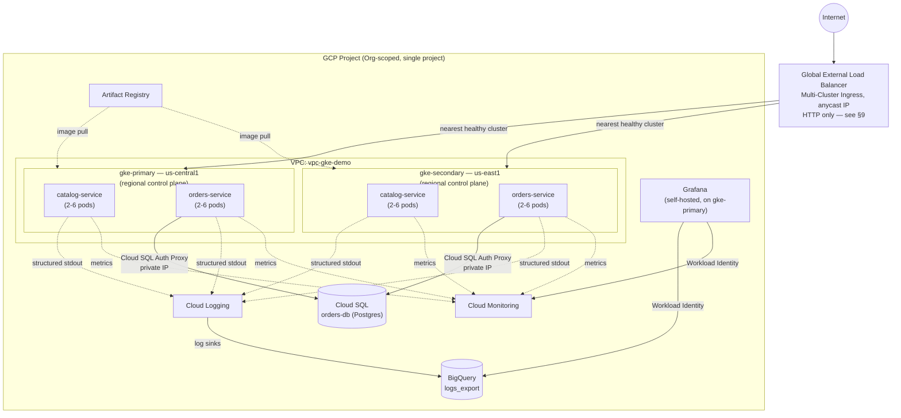
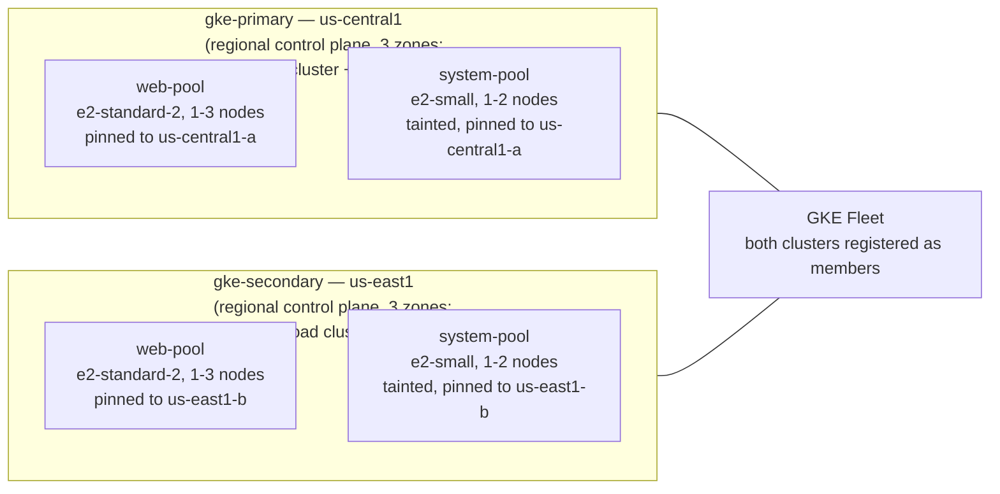
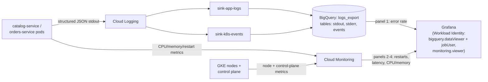

# Design Doc: GCP Project with Two GKE Clusters, Two Web Apps, Multi-Pod Deployment & Full Observability

Source requirements: `../instructions`.

## 0. Naming & convention reference

Everything below (Terraform, Kubernetes manifests, BigQuery, Grafana) uses these exact names. Keep this table open while reading the other docs — it's the map between this write-up and the actual code in the repo.

| Concept | Value |
|---|---|
| GCP Project ID | `var.project_id` (you supply, e.g. `schwab-gke-demo-2026`) |
| Org / Folder | `var.org_id` / `var.folder_id` (optional, default `null` — see §1) |
| Primary region / zone | `us-central1` / `us-central1-a` |
| Secondary region / zone | `us-east1` / `us-east1-b` |
| VPC | `vpc-gke-demo` |
| Subnets | `snet-gke-primary` (10.10.0.0/20), `snet-gke-secondary` (10.11.0.0/20), `snet-lb` (10.40.0.0/24), `snet-ops` (10.41.0.0/24) |
| Pod/Service secondary ranges | primary: `pods-primary` 10.20.0.0/14, `svc-primary` 10.24.0.0/20 — secondary: `pods-secondary` 10.28.0.0/14, `svc-secondary` 10.34.0.0/20 |
| Cloud NAT | `nat-us-central1`, `nat-us-east1` |
| GKE clusters | `gke-primary` (us-central1), `gke-secondary` (us-east1) |
| Node pools | `web-pool` (e2-standard-2, general workloads), `system-pool` (e2-small, ingress/mesh) |
| Fleet (Hub) | project default fleet, memberships `gke-primary`, `gke-secondary`; MCI config cluster = `gke-primary` |
| Artifact Registry | `us-central1-docker.pkg.dev/<project>/apps` |
| App A | `catalog-service` — stateless, in-memory |
| App B | `orders-service` — Spring Boot + Cloud SQL (Postgres) |
| K8s namespace | `apps` (workloads), `monitoring` (Grafana) |
| Cloud SQL instance | `orders-db` (Postgres 15, `db-f1-micro` for cost) |
| BigQuery dataset | `logs_export` |
| Log sinks | `sink-app-logs` (container stdout/stderr), `sink-k8s-events` (pod lifecycle/restart events) |
| Grafana | self-hosted via Helm in `gke-primary`, namespace `monitoring` |

## Architecture at a Glance



Solid arrows are the customer request path; dotted arrows are the observability
side-channel (logs/metrics flowing out, independent of request traffic). See §4 for
the detailed request-by-request walkthrough, §5 for how the observability arrows above
become the 4 Grafana panels.

## 1. Project Structure & Governance

A single GCP project (`var.project_id`) hosts everything for this exercise. Project creation itself is done by Terraform (`terraform/modules/project`, `google_project` resource, `var.create_project = true` by default), including billing-account linkage via `var.billing_account` — this satisfies the spec's "Infrastructure as Code: Terraform to reproduce the entire setup" deliverable for the project bootstrap too, not just everything inside it. The textbook `Folder → Project` hierarchy is created when `var.org_id`/`var.folder_id` are set; left null, Terraform creates a standalone org-less project instead. Note that "personal account" doesn't always mean "no Organization": some personal Gmail accounts have a lightweight Cloud Identity org auto-provisioned by Google even without anyone setting one up deliberately — always check with `gcloud organizations list` before assuming it'll be empty. If it returns a row, setting `org_id` to it (leaving `folder_id` null) creates the project directly under that Org, which satisfies the spec's resource-hierarchy ask without the extra work of also provisioning a Folder. A resource `precondition` fails fast with a clear message if `billing_account` is missing while `create_project = true`, instead of surfacing a raw GCP API error. `create_project = false` remains available for the case where the project already exists and you only want Terraform to configure it (enable APIs, bind IAM) — see `docs/IMPLEMENTATION.md` Step 1.

IAM is modeled as four role bundles, bound to Google Group emails passed as variables (`var.dev_group`, `var.ops_group`, `var.sre_group`, `var.cicd_service_account`):

- **Dev** — `roles/container.developer`, `roles/artifactregistry.writer` (deploy/iterate on workloads, push images)
- **Ops** — `roles/container.admin`, `roles/compute.networkAdmin` (cluster/network lifecycle)
- **SRE** — `roles/monitoring.admin`, `roles/logging.admin` (own the observability stack)
- **CI/CD** — a dedicated service account with `roles/container.developer` + `roles/artifactregistry.writer`, no human login, used by the deploy pipeline

If a group variable is left empty, that binding is skipped (`terraform/modules/project/iam.tf` uses `for_each` over a filtered map) — so this applies cleanly whether or not you have real Google Groups provisioned for the exercise.

**Centralized logging & monitoring** is just "use the project's default `_Default` log bucket/sink" plus the two custom sinks described in §5 — no separate logging project, to keep this inside one project for the exercise.

### Networking

- One VPC (`vpc-gke-demo`), custom-mode, four subnets per the table above — GKE traffic, load balancer, and ops/monitoring are segregated by subnet so firewall rules and future Shared-VPC handoff are straightforward.
- **Shared VPC**: not used. The spec calls it out as something only needed "if your enterprise networking team centrally manages ingress/egress" — not the case for a single-project demo. Documented here as a one-variable change (`shared_vpc_host_project`) if this becomes part of a real org rollout.
- **Private Service Access** is provisioned in `vpc-gke-demo` (allocated range `10.50.0.0/16`) so Cloud SQL can use a private IP instead of public IP.
- **Cloud NAT** — one per region (`nat-us-central1`, `nat-us-east1`), each with its own Cloud Router, so private GKE nodes get outbound internet (pulling base images, hitting `pkg.dev`, etc.) without public IPs.
- **Firewall**: default-deny ingress, explicit allows for (a) GKE control plane → node webhooks, (b) IAP-based SSH range `35.235.240.0/20` for break-glass node access, (c) intra-VPC traffic on the pod/service ranges.

## 2. GKE Cluster Architecture

Two **VPC-native, private** GKE Standard clusters (Autopilot was considered — see decision log in §9):

| | `gke-primary` | `gke-secondary` |
|---|---|---|
| Region | us-central1 | us-east1 |
| Topology | Regional control plane (3 zones), node pools pinned to zone `-a` | Regional control plane (3 zones), node pools pinned to zone `-b` |
| Node pools | `web-pool` (e2-standard-2, 1–3 nodes, autoscaling), `system-pool` (e2-small, 1–2 nodes) | same shape |
| Networking | `snet-gke-primary`, alias IPs from `pods-primary`/`svc-primary` | `snet-gke-secondary`, alias IPs from `pods-secondary`/`svc-secondary` |
| Workload Identity | enabled (`<project>.svc.id.goog`) | enabled |
| Private nodes | yes (no public node IPs; NAT for egress) | yes |

**Why regional, with node pools pinned to one zone**: a regional control plane survives a single-zone outage within the region — closer to the spec's "high availability" intent than a zonal control plane. The catch is cost: the GKE cluster-management fee ($0.10/hr) applies per cluster either way (GCP's Always-Free tier only waives it for one *zonal* cluster per billing account, and we already run two), and a regional cluster's node pools default to fanning out across all 3 zones in the region — tripling node compute. We avoid that second cost by setting `node_locations` on each cluster to a single zone (`var.zone_primary`/`var.zone_secondary`), so node count and machine types are identical to a zonal setup; only the control plane is multi-zone. Net extra cost over an all-zonal setup is roughly $0.10/hr (losing the one free zonal slot) — a couple of dollars for a multi-day demo, trivial against the $300/90-day trial credit. `var.gke_cluster_locations = "zonal"` remains available as a one-line toggle (see `terraform/variables.tf`) if you want the control plane zonal too, e.g. to shave that last $0.10/hr.

**Role split**: `gke-primary` doubles as the **MCI config cluster** (the cluster that holds the `MultiClusterIngress`/`MultiClusterService` resources — see §3) and as the Grafana host. `gke-secondary` is a peer workload cluster; nothing about it is "lesser," the config-cluster designation is just where the multi-cluster routing objects live.



`system-pool`'s taint means it only ever scales up if something actually needs to
tolerate it (none of this exercise's workloads do) — seeing it sit at 0 nodes in
`kubectl get nodes` is expected, not a bug (see `docs/TROUBLESHOOTING.md` if this comes
up live).

## 3. Application Deployment Design

Both apps are deployed identically into the `apps` namespace on **both** clusters.

### Web Application A — `catalog-service`
- Stateless Spring Boot service, in-memory product catalog data.
- `Deployment` with `replicas: 2`, `HorizontalPodAutoscaler` targeting 60% CPU, min 2 / max 6 pods.
- Config via `ConfigMap` (`catalog-config`); no secrets needed.
- `/api/catalog/stress?ms=` endpoint exists purely to generate CPU load on demand for the HPA demo.

### Web Application B — `orders-service`
- Stateless Spring Boot service, but talks to **Cloud SQL for PostgreSQL** (`orders-db`) for persistence — the spec explicitly allows Pub/Sub, Cloud SQL, or Memorystore; Cloud SQL was chosen because it best demonstrates Workload Identity + Secret Manager end-to-end (see §7), which the spec separately asks for.
- Pod has two containers: `orders-service` and a `cloud-sql-proxy` sidecar (Cloud SQL Auth Proxy v2) listening on `127.0.0.1:5432`; the proxy itself authenticates to Cloud SQL using the pod's Workload Identity (no credential file needed). The DB password Terraform generated and stored in Secret Manager reaches the app as a Kubernetes Secret (`orders-db-credentials`) synced by `scripts/sync-orders-db-secret.sh` at deploy time — Secret Manager stays the source of truth and the password is never committed to Git, but the actual in-cluster delivery mechanism is a plain Secret rather than the Secret Manager CSI driver (which would need a cluster add-on whose Terraform support varies by provider version — not worth the risk this close to the deadline; flagged as a clean follow-up in §9).
- `Deployment` with `replicas: 2`, `HorizontalPodAutoscaler` 2–6 pods on CPU.
- The Cloud SQL instance itself is **not** replicated across regions for this exercise (a single instance in `us-central1` with private IP, reachable from both clusters over the VPC) — true cross-region Cloud SQL HA (read replica in `us-east1`) is listed as a DR follow-up in §6 rather than built, to keep cost/time bounded; the proxy/Workload Identity/Secret Manager wiring is identical either way.

`orders-service`'s Workload Identity + Secret Manager wiring, end to end (this is the
same pattern `catalog-service` uses minus the Cloud SQL pieces, since it needs no GCP
permissions beyond the default node SA roles in §7):

The DB password itself flows Secret Manager → `scripts/sync-orders-db-secret.sh` → a
plain Kubernetes `Secret` the pod mounts as env vars — the *pod* never calls Secret
Manager directly; only the one-time sync script does, using its own `gcloud`
credentials, not Workload Identity. The Workload Identity binding above is what lets
the `cloud-sql-proxy` sidecar authenticate the actual database *connection* without any
credential file.

### Ingress & Traffic Distribution
- **Global External Load Balancer** fed by **Multi-Cluster Ingress (MCI)**, fronting both clusters under one anycast IP. Running **HTTP-only, not HTTPS, for this exercise** — a Google-managed SSL cert requires a real domain to issue against, and this demo never had one (see the deviation log in §9). The LB, MCI, NEGs, health checks, and failover all work identically either way; only the listener protocol/port differs (80, not 443). Don't test the live endpoint by typing the bare IP into a browser address bar — most browsers auto-upgrade that to `https://` by default and will fail with a connection error since nothing listens on 443. Always use the explicit `http://` scheme.
- MCI requires both clusters registered to the project's GKE **Fleet** (`gcloud container fleet memberships register` / `google_gke_hub_membership`), with the Multi-cluster Ingress feature enabled and `gke-primary` set as the config cluster. This is a Fleet/GKE feature, not a full Anthos Service Mesh license — no extra licensing cost beyond standard GKE.
- `MultiClusterService` objects fan out to the `catalog-service`/`orders-service` Kubernetes `Service` in each member cluster; `MultiClusterIngress` defines the single global routing rule (path-based: `/api/catalog*` → catalog-service, `/api/orders*` → orders-service).
- Health checks on the backend NEGs drive automatic failover: if all pods in one cluster fail readiness, the LB stops sending traffic there without any manual DNS or config change.

### Inter-Service Communication
- Direct in-cluster `ClusterIP` Services for now; **Anthos Service Mesh is listed as an optional enhancement, not built** — for two simple stateless services with no service-to-service calls between them, mTLS/traffic-shaping mesh overhead isn't justified for this exercise. If a future iteration adds service-to-service calls (e.g., orders calling catalog to validate a product), revisit ASM then.

## 4. Customer Traffic: End-to-End Flow

```
Customer
  │  HTTP to http://<LB IP>  (HTTPS not built — no domain for a managed cert,
  │  see §9; use the explicit http:// scheme, don't rely on browser auto-upgrade)
  ▼
Cloud DNS  ───────────────►  A record → Global LB anycast IP (optional, only if
  │                          you point a real domain at it — not required to demo)
  ▼
Global External Load Balancer
  │  - URI routing: /api/catalog* , /api/orders*
  │  - Cloud Armor inspection (rate-limit + OWASP CRS preview rules)
  ▼
Multi-Cluster Ingress → backend NEG selection (nearest healthy cluster)
  │
  ├──────────────► gke-primary (us-central1)        ├──► gke-secondary (us-east1)
  │   GKE Ingress/NEG → Service (ClusterIP)          │     same path
  │       → Deployment pods (2–6 replicas)           │
  ▼
Pods process request, write structured JSON logs to stdout,
emit request metrics (latency, status) picked up by the LB + GKE logging agent
  │
  ▼
Response: Pod → Service → Ingress NEG → LB → Customer
  (latency, access logs, and traces captured automatically at each hop)
```

Rolling updates (`maxUnavailable: 0, maxSurge: 1`) and pod replicas mean no customer-visible downtime during deploys or single-pod failures; MCI health checks mean no customer-visible downtime during a whole-cluster outage.

## 5. Observability (Logging, Monitoring, Tracing)

### Cloud Logging
- GKE's built-in logging agent ships container stdout/stderr and node logs automatically — no extra config beyond `logging_service = "logging.googleapis.com/kubernetes"` on the cluster (default for new clusters).
- Two project-level **log sinks** route into BigQuery (see below): `sink-app-logs` (container logs, filtered to the `apps` namespace) and `sink-k8s-events` (Kubernetes lifecycle events — restarts, OOMKills, scheduling failures).
- VPC flow logs and firewall logs are enabled on the GKE subnets for east/west visibility; LB request logs are enabled on the backend services for the latency-percentile dashboard panel.

### Cloud Monitoring
GKE's automatic workload metrics (no extra agent needed) cover pod CPU/memory, node health, and HPA scaling events out of the box; Grafana's **Cloud Monitoring** data source queries these directly — they are *not* round-tripped through BigQuery, because Cloud Monitoring is the system of record for metrics and re-deriving CPU/memory time series from logs would be slower and less accurate than querying the metric store directly.

### BigQuery + Grafana
This is the one place the spec's wording needed interpretation, so it's worth being explicit:

> "Query BigQuery for application error rates over time / Pod restart counts by namespace / Request latency percentiles / Resource utilization trends"

Read literally, all four panels query BigQuery. In practice, two of those four (restart counts, resource utilization) are metrics Cloud Monitoring already collects natively and well; forcing them through a log-export-to-BigQuery round trip would mean reconstructing metric semantics from log lines, which is both more fragile and not how GCP-native dashboards are normally built. The dashboard below keeps the **data each system is best at**, while still satisfying the explicit "BigQuery for application error rates" instruction and the general "Observability with BigQuery & Grafana" section header:

| # | Panel | Data source | Query |
|---|---|---|---|
| 1 | Application error rate over time | **BigQuery** (`logs_export`) | `bigquery/sample_queries.sql` §1 — `COUNTIF(jsonPayload.level IN ('ERROR','WARN'))/COUNT(*)` per app per hour. Queries `jsonPayload.level`, not the top-level `severity` column — Cloud Logging only auto-promotes a JSON field literally named `severity`, and the apps' logback config doesn't actually produce one despite intending to; see `docs/TROUBLESHOOTING.md` #9. |
| 2 | Pod restart counts by namespace | Cloud Monitoring (`kubernetes.io/container/restart_count`) — cross-checked against `sink-k8s-events` in BigQuery, see `bigquery/sample_queries.sql` §2 | Grafana Cloud Monitoring panel |
| 3 | Request latency percentiles (p50/p95/p99) | Cloud Monitoring (`loadbalancing.googleapis.com/https/total_latencies`) | Grafana Cloud Monitoring panel |
| 4 | Resource utilization trends (CPU/Memory) | Cloud Monitoring (`kubernetes.io/container/cpu/core_usage_time`, `.../memory/used_bytes`) | Grafana Cloud Monitoring panel |

If a reviewer wants all four strictly from BigQuery, `bigquery/sample_queries.sql` includes equivalent BQ-only versions of panels 2–4 derived from the log sinks (restart counts from `sink-k8s-events`, latency from LB request logs, CPU/memory approximated from container log volume as a fallback) — slower to query and noisier, but present so the literal requirement is satisfiable too. Grafana is deployed via Helm into `gke-primary`/`monitoring`, with both the `grafana-bigquery-datasource` and the native Google Cloud Monitoring data source plugins provisioned (see `grafana/provisioning/datasources/`).



Two Workload Identity roles drive the BigQuery side specifically:
`roles/bigquery.dataViewer` (read the dataset) *and* `roles/bigquery.jobUser` (actually
run a query job) — granting only one is a real, easy-to-hit failure mode, see
`docs/TROUBLESHOOTING.md` #4.

### Cloud Trace / Cloud Profiler / Error Reporting
- **Error Reporting** works out of the box with zero extra integration: uncaught exceptions surface automatically once structured logs include a stack trace in the standard format, which the logging setup in `apps/*/README.md` already produces.
- **Cloud Trace** and **Cloud Profiler** are intentionally *not* wired into the base apps in this pass — both need an extra Maven dependency (`spring-cloud-gcp-starter-trace`) or a Java agent added to the Dockerfile, and verifying either against a real build/cluster was judged not worth the risk this close to the deadline versus the four actual deliverables (working endpoint, Grafana dashboard, BigQuery queries, troubleshooting writeup). `docs/IMPLEMENTATION.md` step 9 has the exact one-dependency / one-env-var changes to bolt them on if time remains after the core deliverables are demo-ready.

## 6. High Availability & Disaster Recovery

- Two GKE clusters in two regions + MCI health-check-driven failover = the cross-regional redundancy layer.
- **State**: only `orders-service` has state (Cloud SQL). For this exercise the instance is single-region (§3); the documented production follow-up is a cross-region **read replica** in `us-east1` promotable on failover, or moving to Cloud SQL HA (regional) configuration — both are one Terraform variable away (`var.cloudsql_availability_type = "REGIONAL"` and an extra `google_sql_database_instance` replica resource), intentionally not turned on here to control cost/time given the deadline.
- **Backups**: Cloud SQL automated daily backups + point-in-time recovery are enabled (`backup_configuration` block, 7-day retention). GKE itself has no etcd to back up directly (Google manages the control plane for Standard clusters) — workload state lives in Git (these manifests), which **is** the backup/restore mechanism for cluster config. Artifact Registry has no built-in backup policy in this exercise; images are reproducible from source, so the Git repo is the source of truth.

## 7. Security

- **Workload Identity** maps each Kubernetes ServiceAccount (`catalog-service-sa`, `orders-service-sa`) to a dedicated GCP service account with least-privilege roles (`orders-service-sa` → `roles/cloudsql.client` + `roles/secretmanager.secretAccessor`; `catalog-service-sa` → no extra GCP roles needed).
- **Secret Manager** holds the `orders-db` password as the source of truth; it reaches the pod as a Kubernetes `Secret` synced at deploy time by `scripts/sync-orders-db-secret.sh` (see §3) — the Secret itself is never checked into Git, only the script that produces it.
- **Private GKE clusters** — both clusters have private nodes (§2); only the control plane has a (firewalled) public endpoint for `kubectl` access during the exercise. For a stricter posture, switch to a private control-plane endpoint reached via Cloud IAP/bastion — documented as a follow-up, not built, since it would block the Tuesday/Wednesday demo's ad-hoc `kubectl` access.
- **Cloud Armor**: a WAF policy with rate-limiting + preconfigured OWASP rules (SQLi/XSS preview→enforce) attached to the global LB backend service.
- **Binary Authorization**: enabled in "dry-run" mode requiring images to be built and pushed through Cloud Build with provenance attached, with a single attestor; dry-run (rather than enforced) is the right default for a demo so it never blocks the Tuesday/Wednesday walkthrough, while still being the literal feature the spec asks for and something you can flip to enforced in one `gcloud` command.

## 8. Deliverables mapping

| Spec deliverable | Where it lives |
|---|---|
| Infrastructure as Code (Terraform) | `terraform/` |
| Architecture diagram | §4 above (ASCII/mermaid); see also `docs/IMPLEMENTATION.md` step 0 for a renderable mermaid block |
| Step-by-step setup instructions | `docs/IMPLEMENTATION.md` |
| BigQuery schema and sample queries | `bigquery/sample_queries.sql` |
| Design decisions and rationale | this document, especially the called-out "why" notes in §2, §3, §5, §6, §7 |
| Working cluster + accessible endpoint | implementation guide step 10 (verify LB IP responds) |
| Grafana dashboard screenshot/export | implementation guide step 12 |
| Troubleshooting scenario | `docs/TROUBLESHOOTING.md` |

## 9. Decision log (Autopilot vs Standard, and other calls made)

- **GKE Standard, not Autopilot**: Autopilot removes node-pool-level control (no separate `system-pool`, no manual HPA-on-CPU-without-resource-requests workarounds) and the spec explicitly lists node pools and "Standard or Autopilot depending on operational model" — Standard was chosen because the spec's node-pool segmentation (general-purpose vs system) is more naturally a Standard-cluster concept and it's cheaper to right-size at this small scale.
- **Regional clusters, node pools pinned to one zone**: see §2 — a 3-zone control plane for real HA, without paying for 3x node compute. (Earlier drafts of this doc said "zonal over regional, for cost" — superseded once the actual marginal cost was worked out to be trivial; node-pool zone-pinning gets the cost savings without giving up control-plane HA.)
- **Cloud SQL over Pub/Sub/Memorystore for App B**: best demonstrates Workload Identity + Secret Manager, which the spec separately requires under Security.
- **Self-hosted Grafana via Helm, not Grafana Cloud SaaS**: keeps everything inside the one GCP project/VPC with no third-party account signup, and is what "Cloud-hosted Grafana" most naturally means when read alongside "use GCP native capabilities" elsewhere in the spec — it runs *on* GCP compute, even though it isn't a literal first-party "Google Cloud Managed Grafana" product (GCP doesn't currently offer one the way AWS does).
- **Binary Authorization in dry-run, Cloud Armor in preview-then-enforce**: both are real, configured, and visible in the console for the demo, without risk of blocking the Tuesday/Wednesday walkthrough if something is mis-tuned.
- **HTTP-only load balancer, no HTTPS**: the spec calls for a "Global External HTTPS Load Balancer," but a Google-managed SSL cert requires a real domain to issue against, and this demo never registered one. Building a self-signed cert for a bare IP was considered and rejected — it would replace a clean connection failure with a scary "connection not private" browser warning that's *more* confusing to a reviewer unfamiliar with the setup, for no real security benefit in a torn-down-after-the-demo exercise. Everything else in the spec's ingress requirement (MCI, NEGs, health-check-driven failover, URI routing, Cloud Armor) is built and real; only the TLS termination layer is skipped. If this became a real production rollout, the fix is a one-line addition: point a real domain at the LB IP and let GKE Ingress provision the Google-managed cert automatically.
